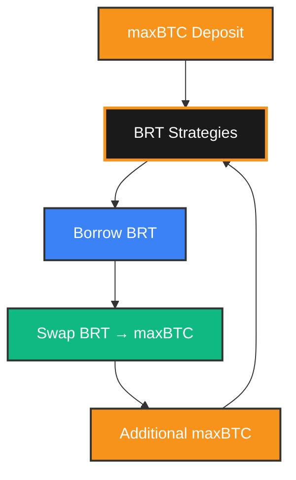

# Looping BRTs

## Strategy Guide

A guide to using leverage strategies (“looping”) to maximize your Bitcoin-related token (BRT) yields on Amber Finance.

---

## Understanding Leverage Strategies

Looping lets you **amplify the staking yield of maxBTC** by borrowing BRTs against your maxBTC collateral and redeploying it into more yield-bearing maxBTC — repeatedly — to multiply your exposure.

Amber offers pre-configured loops ranging from **conservative 1.1×** to **high-octane 8.3×**, each with different Health Factor (HF) safety buffers.

### Maximum Leverage

With LTV (Loan-to-Value) ratios up to **90%**, Amber Finance enables leverage up to **10x** on your positions. This means you can amplify your Bitcoin exposure significantly.

**Leverage Examples:**
- **5x leverage** with 80% LTV
- **10x leverage** with 90% LTV
- **12.5x leverage** with 92% LTV (theoretical maximum)

*Note: Actual leverage may be lower due to safety buffers and swap fees.*

---

## How Looping Works

1. **Deposit maxBTC collateral**
2. **Borrow any supported BRT** — e.g., LBTC, solvBTC, pumpBTC.
3. **Swap** borrowed assets into maxBTC (5 bps swap fee).
4. **Repeat** until you reach your target leverage and HF.
5. **Earn yield** on the full leveraged position.

### Visual Guide: Leverage Flow

**Key Components:**
- **maxBTC**: Your Bitcoin exposure and yield-bearing asset
- **BRT Strategies**: Secure lending protocol with health factor monitoring
- **Borrow**: Access to multiple BRTs for borrowing
- **Swap**: Seamless conversion between BRTs (5 bps fee)
- **Loop**: Continuous cycle to amplify your position

---

### Example: maxBTC - LBTC Yield Amplification

* **maxBTC Yield**: 12% APY
* **LBTC Borrow Rate**: 2.5%
* **Initial deposit**: \$10,000 maxBTC
* **Target leverage**: 3×
* **Effective position size**: \$30,000 maxBTC equivalent
* **Effective debt size**: \$20,000 LBTC
* **Gross yield**: (12% × 3) -(2.5% x 2) = **31% APY**
