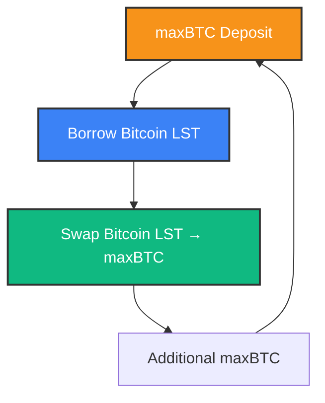

# Looping maxBTC

## Strategy Guide

A guide to using leverage strategies ("looping") to maximize your maxBTC yields on Amber Finance.

---

## Understanding Leverage Strategies

Looping lets you **amplify the staking yield of maxBTC** by borrowing Bitcoin LSTs against your maxBTC collateral and swapping it to redeploy into more yield-bearing maxBTC, repeatedly, to multiply your exposure.

Amber offers pre-configured loops with up to 12x leverage.

---

## How Looping Works

1. **Deposit maxBTC collateral**
2. **Borrow any supported Bitcoin LST** (e.g., LBTC, solvBTC)
3. **Swap** borrowed assets into maxBTC (0.05% swap fee)
4. **Earn yield** on the full leveraged maxBTC position

### Visual Guide: Leverage Flow

**Key Components:**

- **maxBTC**: Your Bitcoin exposure and yield-bearing asset
- **Borrow**: Access to multiple Bitcoin LSTs for borrowing
- **Swap**: Seamless conversion between Bitcoin LSTs
- **Loop**: Continuous cycle to amplify your position

---

### Example: maxBTC - LBTC Yield Amplification

- **maxBTC Yield**: 12% APY
- **LBTC Borrow Rate**: 2.5%
- **Initial deposit**: \$10,000 in maxBTC
- **Target leverage**: 3×
- **Effective position size**: \$30,000 in maxBTC equivalent
- **Effective debt size**: \$20,000 in LBTC
- **Gross yield**: (12% × 3) -(2.5% x 2) = **31% APY**

_NOTE: These are only exemplary values_
